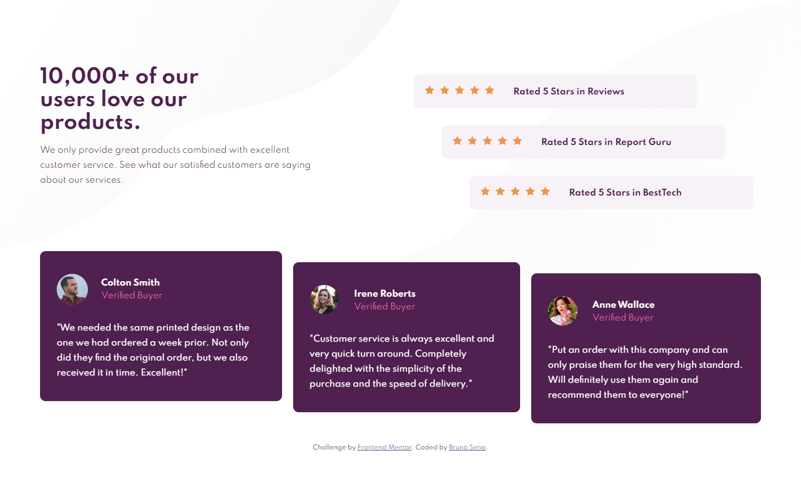

# Frontend Mentor - Social proof section solution

This is a solution to the [Social proof section challenge on Frontend Mentor](https://www.frontendmentor.io/challenges/social-proof-section-6e0qTv_bA). Frontend Mentor challenges help you improve your coding skills by building realistic projects. 

## Table of contents

- [Overview](#overview)
  - [The challenge](#the-challenge)
  - [Screenshot](#screenshot)
  - [Links](#links)
- [My process](#my-process)
  - [Built with](#built-with)
  - [What I learned](#what-i-learned)
- [Author](#author)

## Overview

### The challenge

Users should be able to:

- View the optimal layout for the section depending on their device's screen size

### Screenshot




### Links

- Solution URL: [GitHub](https://github.com/brujavsen/social-proof)
- Live Site URL: [Netlify](https://social-proof-section-master-bruno.netlify.app/)

## My process

### Built with

- Semantic HTML5 markup
- CSS custom properties
- Flexbox
- CSS Grid
- Mobile-first workflow

### What I learned

It was one of the challenges that cost me the most to give shape and space. Since everything was always uneven and I wanted its content to be proportional to the screen. But I was able to do the responsive version for tablet and mobile well, but I hope to improve this code in the future.
I'm also proud to have created a reusable function that generates stars based on the number added to it.

```js
function showStars (element, number) {

    // iterates through each of the star containers
    for(let i = 0; i < starsCnt.length; i++){
        element = starsCnt[i];
    
        let numberStars = number;
        
        // create the element according to the number entered
        for(let i = 0; i < numberStars; i++) {
            
            let stars = document.createElement('IMG');
            stars.setAttribute("src", "images/icon-star.svg");
            element.appendChild(stars);
            
        }
    }
}
```

## Author

- GitHub - [@brujavsen](https://github.com/brujavsen)
- Frontend Mentor - [@brujavsen](https://www.frontendmentor.io/profile/brujavsen)